# Creating a New Bow

## Requirements

- You've done everything in [Getting Started](../../gettingstarted.md) and [Palworld Modding Kit](https://pwmodding.wiki/docs/palworld-modding-kit/install-part-1).

- Dummy Blueprints which can be found in the [Resources](../../resources) section.

- Basic understanding of how to use Unreal Engine, there are a ton of tutorials for it and they apply to modding all the same.

## Creating a Bow

After you're done setting up everything, launch the Palworld Modding Kit and let's get started.

### Setup

1. Create the following folder structure: `Pal > Blueprint > MyNewWeaponMod > Blueprint`

    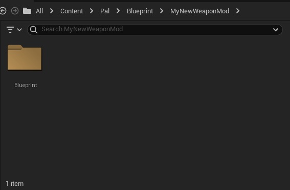

2. In the `MyNewWeaponMod` folder, create a new Data Asset. When you click on Data Asset, it'll show a window asking you to pick a class for the data asset instance. Select `PrimaryAssetLabel` and name the new Data Asset the same as your mod project which is `MyNewWeaponMod` in our case.

    

    

3. Open the newly created `MyNewWeaponMod` Data Asset and change the following values:

    - Chunk ID: 1 - This controls which file the assets in your `MyNewWeaponMod` project will be packaged into. For example we've set this to 1 so everything will be packaged into pakchunk1-Windows.pak after we package the project. Make sure to change this for every separate project you decide to create because otherwise everything gets packaged into the same file unless it's what you want. 
    
      - Make sure to stay on the lower end with Chunk ID as the higher it is the longer it takes to package the project since the editor has to check each ID between your lowest and highest ID.

    - Cook Rule: Always Cook

    - Label Assets in My Directory: Checked - This makes sure everything inside the `MyNewWeaponMod` folder gets packaged.

    

4. Save the Data Asset and navigate over to the Blueprint folder that we created inside `MyNewWeaponMod`.

5. Create a new 'Blueprint Class' and when it asks to pick a parent class, search for BP_BowBase. Make sure you have Dummy Blueprints setup, otherwise you won't see it in the list.

    

6. We'll call it `BP_BowMeteor` in this guide, but you can call it anything really. As for the BP_ prefix, it's just good practice to follow the standard. BP = Blueprint.

7. Next, create a `Bullet` folder and inside the folder create another Blueprint and parent it to `BP_Arrow`. We'll call it `BP_ArrowMeteor`.

    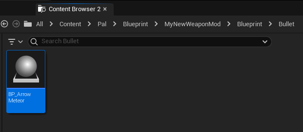

### The Arrow

1. Open the `BP_ArrowMeteor` blueprint and once the window is open, select `Open Full Blueprint Editor`. You should now have the Event Graph open.

    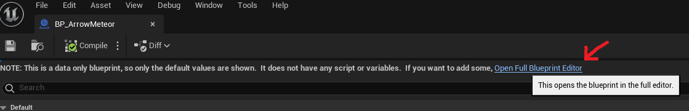

2. Next, we want to add a new function override for the `On Hit` function that our blueprint inherits from `Pal Bullet`.

    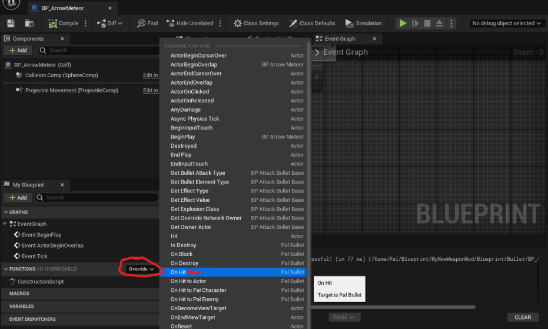

3. Right-click anywhere in the empty space and you should have a context menu open. Search for the function `Get Owner Actor` which will get the owning actor for the weapon. Hover over the blue pin in `Get Owner Actor`, click and drag from it and then release on an empty spot next to the `Get Owner Actor` node. You'll want to look for the `Equal` function next and we'll connect it to the `Other Actor` pin that's in the `On Hit` function override.

    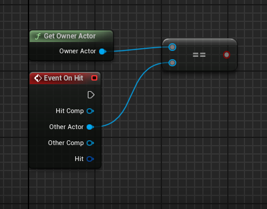

4. Drag from the red pin in the `Equal` node and search for `Branch` and add that to the graph. Create another `Get Owner Actor` function node above `Branch` and then drag from the blue pin to create a `Cast to PalPlayerCharacter`. Connect the `False` execution pin to `Cast to PalPlayerCharacter`. This current setup is so that our own arrow ignores hits on our player character.

    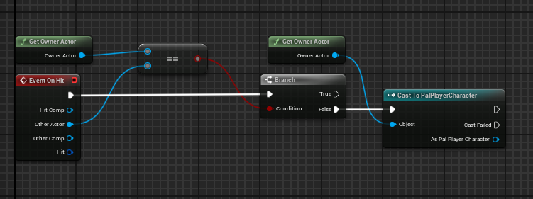

5. Drag from the right execution pin in `Cast to PalPlayerCharacter` and create a `Spawn Actor from Class` node. Click on the `Class` dropdown menu and search for `BP_Explosion_Launcher_Meteor`. Click the little arrow at the bottom of the `Spawn Actor from Class` node we created so we can see all the properties in it.

    Set `Collision Handling Override` to `Always Spawn, Ignore Collisions`

    You'll want to connect the `As Pal Player Character` pin to the `Instigator` and `Owner` pins. Right-click on the `Spawn Transform` pin and select `Split Struct Pin`.

    We're connecting the owner of the weapon to the `Instigator` and `Owner` pins because otherwise, the weapon won't do any damage and it will not register the attacker properly.

    

6. We'll want to go back to our `On Hit` function override node we created earlier and drag from the `Hit` pin and select `Break Hit Result` at the bottom of the Context Menu. You'll get a Hit Result node with a lot of properties so we want to click on the little arrow at the bottom again to expand the node. Drag the `Location` pin and connect it with the `Spawn Transform Location` pin in `SpawnActor BP Explosion Launcher Meteor`.

    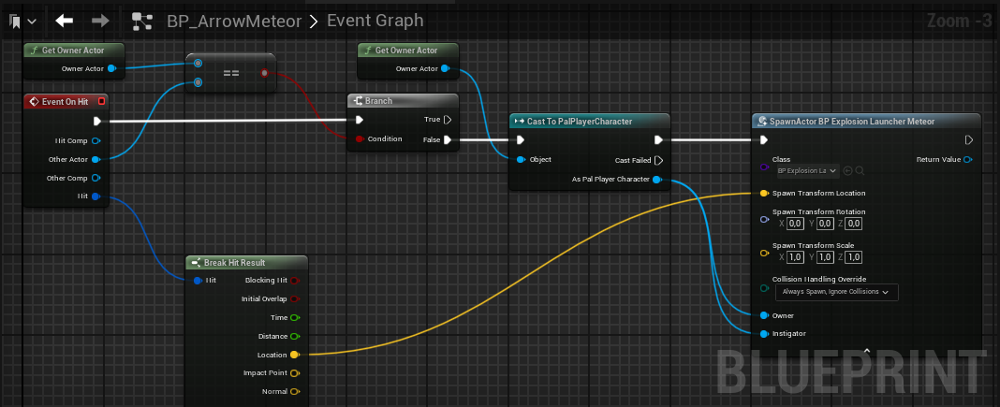

7. Almost done with `BP_ArrowMeteor`. Next, we'll want to go back to our `SpawnActor BP Explosion Launcher Meteor` node and drag from the `Return Value` pin and search for `Set Power` function. Right-click anywhere on the empty space above `SpawnActor BP Explosion Launcher Meteor` and search for the following nodes in the context menu: `Get Weapon Damage` and `Get Sneak Attack Rate`.

    Connect the `Return Value` pin in `Get Weapon Damage` to the `New Param` pin in `Set Power`.

    Connect the `Return Value` pin in `Get Sneak Attack Rate` to the `Snake Rate` pin in `Set Power`.

    

    This sets the explosion damage based on our weapon's stats. You can even do your own custom logic to increase or decrease the damage based on certain conditions, but that will not be covered here. Feel free to explore and experiment!

8. Compile and Save the `BP_ArrowMeteor` blueprint.

    

### The Bow

We're almost done with our new weapon, we just need to change few things in the `BP_BowMeteor` blueprint we created earlier in this guide and we can start packaging the project.

1. Locate the `BP_BowMeteor` blueprint and open its Event Graph. On the left side you'll see BP_BowMeteor and DefaultSceneRoot. Click on BP_BowMeteor and it should open the properties panel on the right side of the window. The only thing we need to change in the properties is the `Arrow Shoot Number`, at least for this guide. Set `Arrow Shoot Number` to 1. This is how many arrows the bow will fire simultaneously.
    
    

    The reason we don't have to worry about the other properties is because we inherit from `BP_BowBase` which means it'll already have defaults assigned to it, meaning we also inherit the model, animations and everything else necessary for the weapon to work properly. You're obviously free to change the Skeletal Mesh and Animations, but that's something that won't be covered in this guide specifically.

2. Create a function override for `Get Arrow Class`.

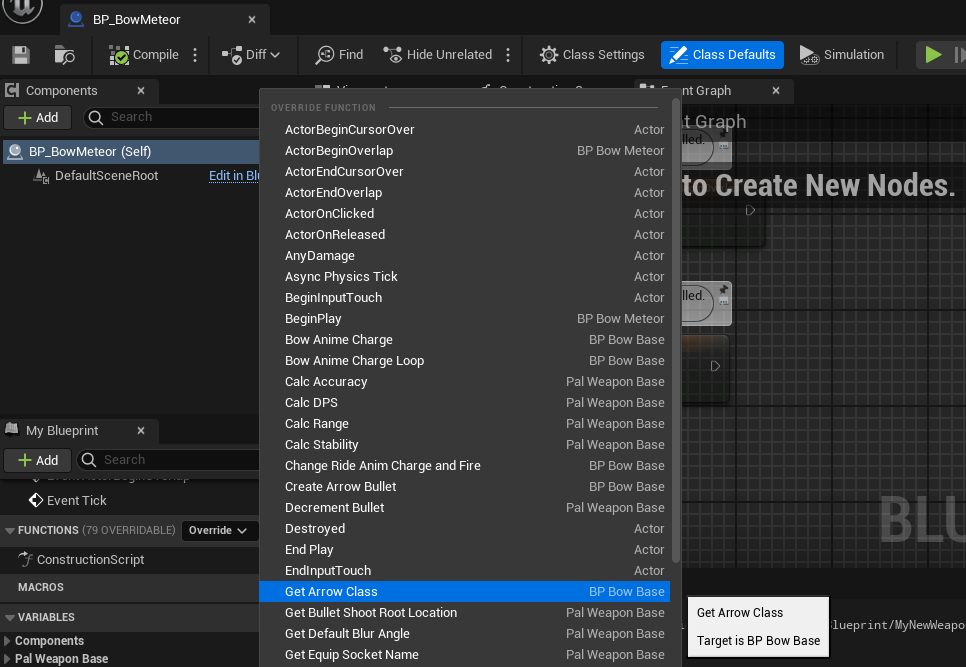

3. Open the `Get Arrow Class` function and you should see the following nodes in the image. Right-click on the `Parent: Get Arrow Class` orange colored node and select `Delete`.


4. The `Arrow Class` node in our `Return Node` will now show a `Select Class` dropdown. Click on the dropdown menu and search for our `BP_ArrowMeteor` class and assign it.

    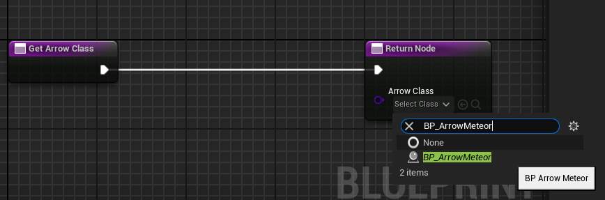

    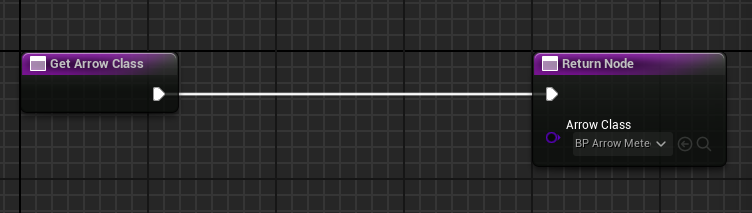

5. Done. Hit Compile and Save on `BP_ArrowMeteor` and let's get packaging.

### Packaging and Installing the Mod

We're finally done in the editor and can begin packaging our new mod, so let's do that.

1. Navigate to `Platforms > Windows` and click Package Project. A new window will appear, but you can just click on `Select Folder` to use the default folder. You can go grab a coffee, tea or some snacks since it might take a few minutes depending on your hardware.

    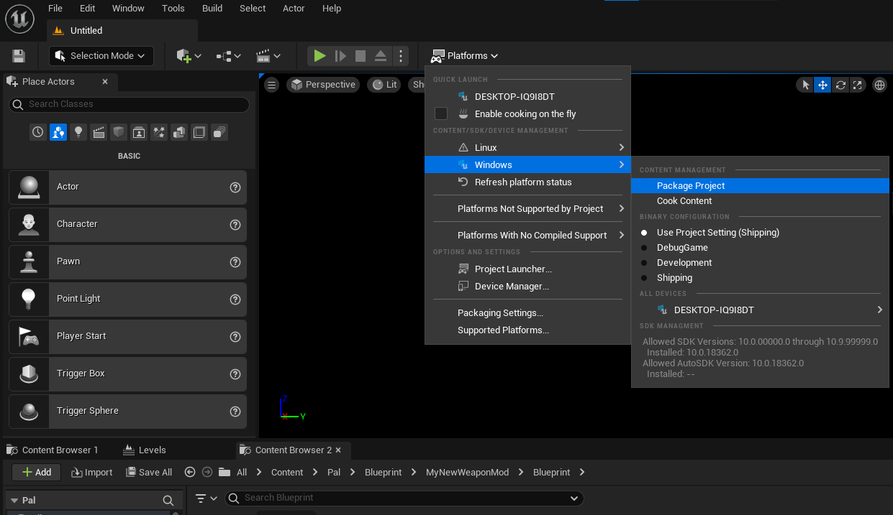

2. After it's done packaging, you can find your `pakchunk(id)-Windows.pak` inside the PalworldModdingKit at `Windows > Pal > Content > Paks` where (id) is the ChunkID you assigned in your `PrimaryAssetLabel` in the Setup section. So if you did ChunkID of 1 then you'll want the `pakchunk1-Windows.pak` file.

    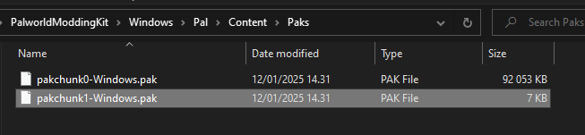

3. Move the `pakchunk(id)-Windows.pak` to a ~mods folder where your Palworld is installed. If you don't have a ~mods folder then you can just create it.

    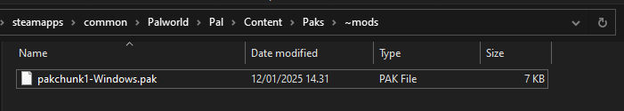

4. This part is important, you must rename the file so the name ends with `_P`, this is so Unreal can recognize the file as a patch pak, otherwise it will not be loaded by the game at all. Let's call it `BowMeteor_P`.

    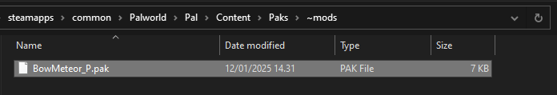

5. Done.

### Pal Schema

Now, to make sure our new Bow is actually usable in the game, we'll have to create a PalSchema mod for it. If you haven't yet, go through the [Getting Started](../../gettingstarted.md) guide first and then come back to this part as it will explain the basics of PalSchema and how it works.

1. In the `PalSchema/mods` folder, create the following folder structure: `MyBowMods/items`

    After that, you'll want to create a json file called `meteor_bow.json`. Feel free to name it whatever you'd like of course, as long as it's a json file.


2. Open the `meteor_bow.json` we created and copy this inside it:

```json
{
    "MOD_Bow_Meteor": {
        "Name": "Meteor Bow",
        "Description": "My first weapon!",
        "Type": "Weapon",
        "IconTexture": "/Game/Others/InventoryItemIcon/Texture/T_itemicon_Weapon_Bow_Fire.T_itemicon_Weapon_Bow_Fire",
        "TypeA": "Weapon",
        "TypeB": "WeaponBow",
        "Rank": 1,
        "Rarity": 0,
        "Price": 5000,
        "MaxStackCount": 1,
        "Weight": 5.0,
        "MagazineSize": 1,
        "AttackValue": 250,
        "SneakAttackRate": 1.0,
        "Durability": 1000.0,
        "actorClass": "/Game/Pal/Blueprint/MyNewWeaponMod/Blueprint/BP_BowMeteor.BP_BowMeteor",
        "Recipe": {
            "Product_Count": 1,
            "WorkAmount": 500.0,
            "Material1_Count": 1,
            "Material1_Id": "Stone",
            "Material2_Count": 1,
            "Material2_Id": "Wood"
        }
    }
}
```

  I've covered most of these in the [Getting Started](../../gettingstarted.md) guide, but I'll be going over some of the fields that weren't mentioned.

  - `actorClass`: This is the important field for weapons, we want this to point at our weapon actor we created in the earlier steps which is the `BP_BowMeteor`. 

  You can obtain the path to the weapon actor by going back into Unreal Editor, right-clicking on the `BP_BowMeteor` asset in the Content Browser and selecting `Copy Reference` which will give you a string like:
  
  `/Script/Engine.Blueprint'/Game/Pal/Blueprint/MyNewWeaponMod/Blueprint/BP_BowMeteor.BP_BowMeteor'` which you'll have to trim down and modify to `/Game/Pal/Blueprint/MyNewWeaponMod/Blueprint/BP_BowMeteor.BP_BowMeteor`.

  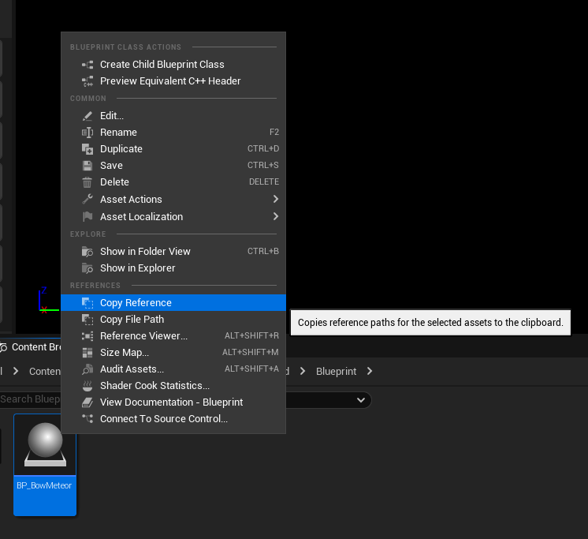

  - `MagazineSize`: Self explanatory, but you can also leave it out entirely and the weapon will have infinite ammo, if that's what you want.

  - `AttackValue`: How much damage the weapon should do.

  - `SneakAttackRate`: Damage multiplier for when you attack enemies that haven't noticed you.

  - `Durability`: Self explanatory.

  Since our TypeA and TypeB are set to `Weapon` and `WeaponBow` and the Rank is set to 1, our weapon will be available for crafting starting from Primitive Workbench, which makes testing a lot easier.

  You're free to change the crafting recipe to whatever you'd like, but I set it as `Stone` and `Wood` since those are materials we can find easily for testing purposes.

3. After you're done, save the file, load up Palworld and enter a world so we can test it out.


Success! We've made our first custom weapon in Palworld. I'll include a little video preview below of the finished product:

<iframe 
  width="560" 
  height="315" 
  src="https://www.youtube.com/embed/-9HphVXqcrI" 
  title="YouTube video player" 
  frameborder="0" 
  allow="accelerometer; autoplay; clipboard-write; encrypted-media; gyroscope; picture-in-picture" 
  allowfullscreen>
</iframe>

### Final Notes

You might be wondering, how would I do this on Game Pass since the asset format is different (ucas, utoc, pak)? You can simply just go into `Edit > Project Settings > Packaging` and enable the `Use Io Store` checkbox. Make sure to disable it whenever you're packaging for Steam.

This is subject to change as we don't know when they'll switch the format to be the same for both Steam and Game Pass.

Instead of a `.pak` file, you'll have three files which are `.ucas`, `.utoc` and `.pak` and you'll want to copy these over to where your Game Pass version is installed. This is the only difference between Steam and Game Pass.
