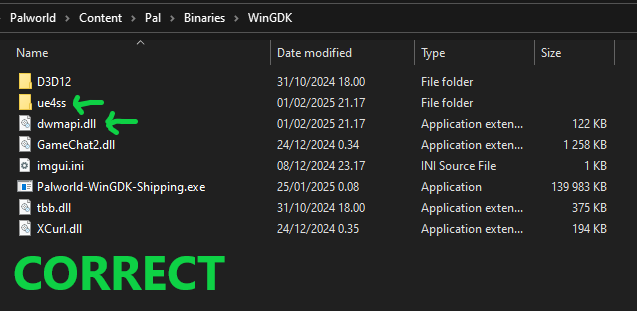
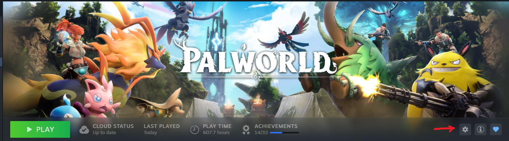
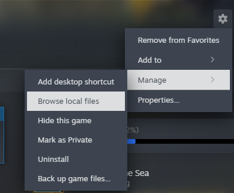
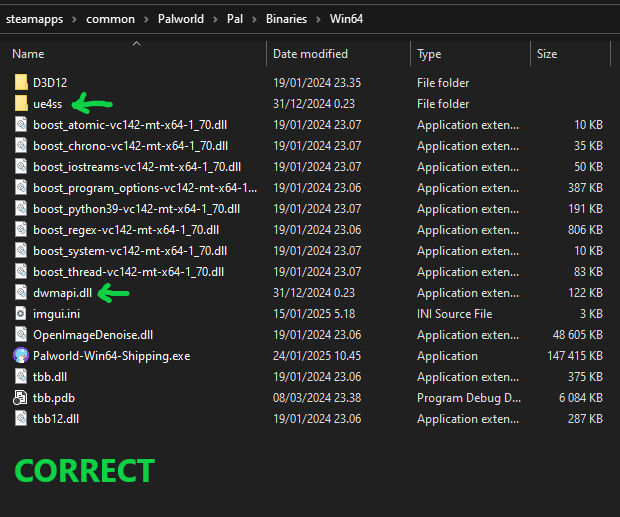
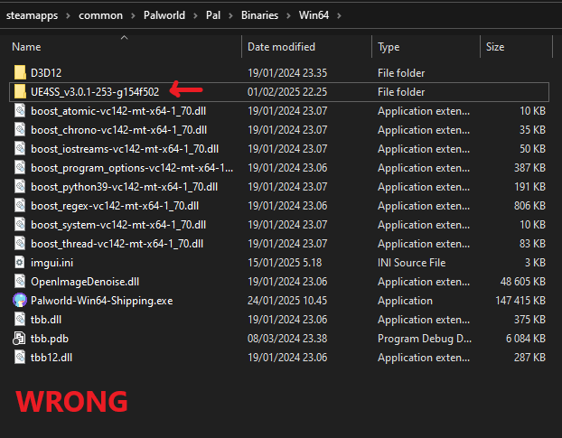
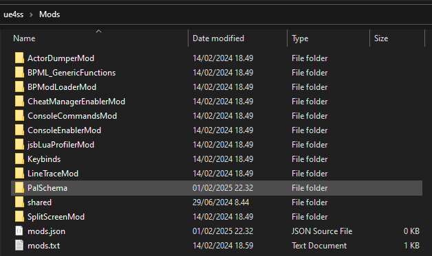
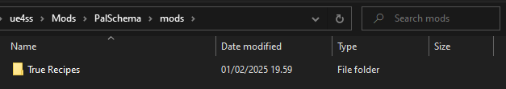

import Tabs from '@theme/Tabs';
import TabItem from '@theme/TabItem';

# Installation

Written by [TheGameAce](https://next.nexusmods.com/profile/TheGameAceReal/mods?gameId=6063)

This guide will get you through the installation & setup process for PalSchema so you can get to making your own mods or enjoy using other's mods created with this new modding tool! If you have any issues with this process, feel free to reach out at the Palworld Modding Community on Discord for further assistance: https://discord.gg/r9j9W67xhA

## Getting PalSchema

The first step in this process will be getting PalSchema, which can be found on GitHub here: https://github.com/Okaetsu/PalSchema/releases

Under each release, you'll see an "Assets" tab at the bottom that you can click on. It's under this tab that you'll see all downloadable contents. Within here you'll see two PalSchema downloads and two corresponding source code downloads. You'll want one of the former two downloads. Both of these have the same process.

 - **Regular Edition**: The first download option in descending order, this version of PalSchema is perfect for regular players who want to use PalSchema mods. Get this version if you don't have any intention of making your own mods via PalSchema.
 - **Dev Edition**: The second download option in descending order, this version of PalSchema works like the regular version with added features designed for mod developers. If you intend to make your own mods with PalSchema, this is the recommended option.

## UE4SS - Correct Version + Installation

The next step of this process is making sure you have UE4SS installed properly, and more specifically the right version of it. As of the current writing of this article, PalSchema only supports the latest experimental version of UE4SS (v.3.0.1-253-g154f502), which can be downloaded directly [here](https://github.com/UE4SS-RE/RE-UE4SS/releases/download/experimental/UE4SS_v3.0.1-253-g154f502.zip).

If you already have this version of UE4SS installed, skip to the next [step](#ue4ss-settings--mod-settings). If not, here's how to set it up:
Firstly, find your Palworld installation location. This will vary from person to person based on installation choices.

<Tabs
  defaultValue="gamepass"
  values={[
    {label: 'Game Pass', value: 'gamepass'},
    {label: 'Steam', value: 'steam'},
  ]}>
  <TabItem value="gamepass">
    For Gamepass users, open up the Xbox app on your computer and go to the Palworld page. In the top right there should be a button with three dots "...". Select this and hit "manage". The below window should pop up, in which you should select the "Files" tab.

    

    Here, you can see the installation location for Palworld on your computer. If you select "Browse", this location will be brought up in your file explorer.

    Now that we've gotten to Palworld's installation location, we'll want to navigate through the folders. It should go `Content -> Pal -> Binaries -> WinGDK`. Put the UE4SS zip file you downloaded in here. Select the zip and then right click -> extract all. If you're using the default Windows way of extracting the files, make sure you extract the contents of the zip rather than extracting UE4SS as a folder. I'll include two examples below for correct and incorrect extraction:

     

    Congratulations, you just installed UE4SS for Palworld!

    **Note**: If you already have UE4SS installed, that's ok. This process will be the same, except you'll want to allow the file dwmapi.dll to override your current one, to direct the game to using the newly installed version instead. You'll also want to move the mods from your current Mods folder under WinGDK, to the Mods folder in the ue4ss folder instead.
  </TabItem>

  <TabItem value="steam">
    For Steam users, open up your Steam library, click on Palworld and then click the gear icon on the right side, then go to "Manage" and "Browse local files".

    

    

    If you select "Browse local files", this location will bring you to the root of your Palworld install in file explorer.

    Now that we've gotten to Palworld's installation location, we'll want to navigate through the folders. It should go `Pal -> Binaries -> Win64`. Put the UE4SS zip file you downloaded in here. Select the zip and then right click -> extract all. If you're using the default Windows way of extracting the files, make sure you extract the contents of the zip rather than extracting UE4SS as a folder. I'll include two examples below for correct and incorrect extraction:

     

    Congratulations, you just installed UE4SS for Palworld!

    **Note**: If you already have UE4SS installed, that's ok. This process will be the same, except you'll want to allow the file dwmapi.dll to override your current one, to direct the game to using the newly installed version instead. You'll also want to move the mods from your current Mods folder under Win64, to the Mods folder in the ue4ss folder instead.
  </TabItem>
</Tabs>

## UE4SS Settings & Mod Settings
Before moving forward, you'll want to make sure that your settings for UE4SS and your Mods folder are correct. For UE4SS, check the UE4SS-settings.ini file.

This can be edited with any text editor, such as Windows notepad or Notepad++. In here, the most common two adjustments that have to be made are setting GraphicsAPI to dx11, and setting bUseUObjectArrayCache to false.

Within your Mods folder under UE4SS, you'll see two files at the bottom: mods.json, and mods.txt.

Both of these files need to be modified the same way. Using mods.txt as an example:

In mods.txt here, a value of 0 equates to a value of "false" in mods.json, while a value of 1 equates to a value of true. CheatManagerEnablerMod, ConsoleCommandsMod, ConsoleEnablerMod, BPModLoaderMod, and BPML_Genericfunctions should all be set to 1 or "true" across both files.

## Installing PalSchema & Using PalSchema Mods
Now that UE4SS is ready to go, we're ready for the long and arduous journey to install PalSchema!

...

Just kidding, it's a quick and easy process from here. Simply take the PalSchema zip you downloaded, extract it, and place the PalSchema folder that results under the Mods folder within UE4SS. You've now successfully installed PalSchema!

 

If your goal is mod development, there will be other guides to help you get started.

If your goal is to just play PalSchema mods, all you have to do to install these mods is navigate into the PalSchema folder, then into "mods". Folders for different mods will go in here. No further work required!

